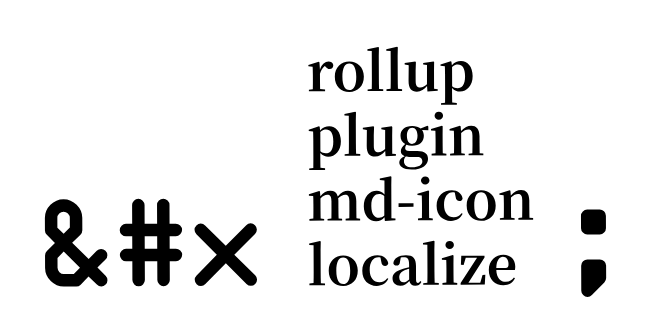

<center>
	
</center>

---

## Why?

If you use `<md-icon>` element from [Material Web 3](https://github.com/material-components/material-web) you probably noticed that there are two inconvenients:

- You don't have the font file locally.
- The requested font file is rather big and include all Material Symbols (around 3.5MB)

This rollup plugin can be used to download the font file that includes only the icons found in your source code.

## Installation

```
npm i -D rollup-plugin-md-icon-localize
```

## Usage

There are 2 steps:

### 1. Download the font file

Everytime you add new icon names in your app, you have to reflect/download the new font file:

You can do that manually from command line

```
npx rpmil src assets
```

`src` is the directory where the command will search recursively for icon names.
`assets` is where the font files will get downloaded, two files precisely:

- `material-symbols.woff2`: The font file itself
- `material-symbols.css` : The stylesheet importing the font and defining the icon class.

You don't need to know what these files do, but you'll have to include `material-symbols.css` somewhere in your source code as a trade-off.

### 2. Use the plugin

The plugin converts icon names to codepoints during build:

```javascript
import {mdIconLocalize} from 'rollup-plugin-md-icon-localize';

export default {
	plugins: [mdIconLocalize()],
};
```

## Contributing

If you find some problems or want to propose an improvement, please open an issue to report and PR's are warmly welcomed.

## License

MIT (c) 2023 Valentin Degenne.
